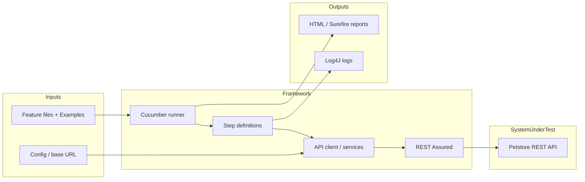
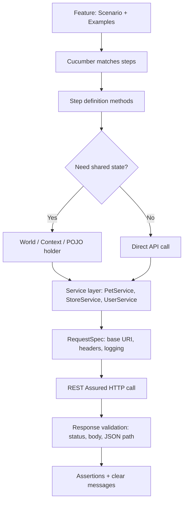
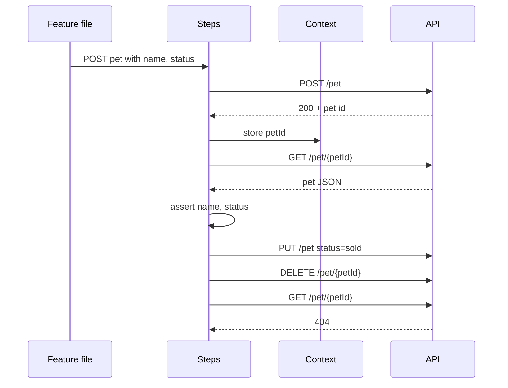
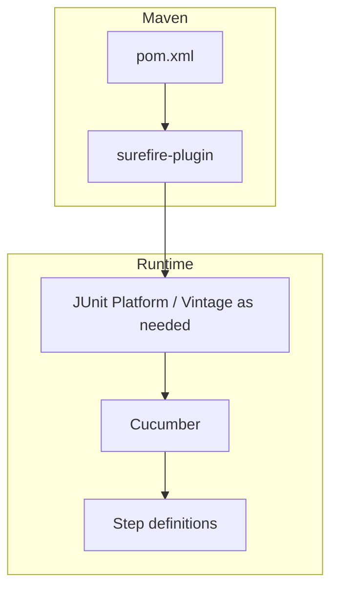

# Precision API BDD Automation Framework — Implementation Plan

This plan is derived from **Precision API BDD Automation Framework.pdf** (source: `Source/Precision API BDD Automation Framework.pdf`), which describes a **hybrid API test automation assignment** using the **Swagger Petstore** API.

---

## 1. Exact goal and purpose

### 1.1 What the framework is for

The document’s purpose is **not** to script one-off API calls, but to **design and implement a maintainable, scalable BDD automation framework** that:

- Expresses API tests in **readable Gherkin** (Cucumber).
- Automates **REST** endpoints with **REST Assured** and **Java**.
- Keeps **all test data dynamic** and driven from **feature files** (and/or external data where appropriate).
- Supports **Maven** execution (`mvn clean test`), **logging** (Log4J), and **execution reports** (e.g. Cucumber HTML + Surefire).
- Covers **four structured scenarios** on `https://petstore.swagger.io/v2` plus **Postman** exercises and **team/documentation** deliverables.

### 1.2 End-to-end purpose flow



### 1.3 How a single BDD scenario flows through the architecture



### 1.4 Data chaining purpose (Test Case 1 & 4)



---

## 2. Architectural design

### 2.1 Layered architecture (recommended)

| Layer | Responsibility | Typical packages / files |
|-------|----------------|---------------------------|
| **Tests (BDD)** | Readable scenarios, examples, tags | `src/test/resources/features/*.feature` |
| **Step definitions** | Glue: map Gherkin to Java, assertions | `src/test/java/.../stepdefs/*.java` |
| **Services / API facade** | Endpoint grouping, reusable verbs | `src/test/java/.../api/PetApiClient.java`, `StoreApiClient.java`, `UserApiClient.java` |
| **Core / client** | Base URI, specs, auth placeholder, timeouts | `src/test/java/.../core/RequestFactory.java` or `ApiClient.java` |
| **Models / DTOs** | JSON mapping (optional but clean) | `src/test/java/.../models/Pet.java`, `User.java` |
| **Context / World** | IDs and responses shared across steps | `src/test/java/.../context/TestContext.java` |
| **Config** | Environment, base URL | `src/test/resources/config.properties`, `Configuration.java` |
| **Hooks & reporting** | Setup/teardown, Cucumber reporting plugin | `Hooks.java`, `TestRunner.java` |
| **Logging** | Step/API logging | `log4j2.xml`, logger in steps/services |

**Evaluation alignment:** The PDF weights **Framework Architecture (25%)** on **client pattern**, **base classes**, and **separation of concerns** — the table above is the direct response to that.

### 2.2 Component interaction (build & run)



### 2.3 Suggested repository layout (file names)

```
project-root/
├── pom.xml
├── README.md
├── docs/
│   └── architecture-diagram.png   (or .drawio — deliverable)
├── src/test/java/com/precision/bdd/
│   ├── runner/TestRunner.java
│   ├── hooks/Hooks.java
│   ├── context/TestContext.java
│   ├── config/Configuration.java
│   ├── core/RequestFactory.java
│   ├── api/
│   │   ├── PetApiClient.java
│   │   ├── StoreApiClient.java
│   │   └── UserApiClient.java
│   ├── models/
│   │   ├── Pet.java
│   │   └── User.java
│   └── stepdefs/
│       ├── PetStepDefs.java
│       ├── StoreStepDefs.java
│       └── UserStepDefs.java
└── src/test/resources/
    ├── features/
    │   ├── pet_lifecycle.feature
    │   ├── inventory_analysis.feature
    │   ├── user_negative.feature
    │   └── cross_endpoint_consistency.feature
    ├── config.properties
    └── log4j2.xml
```

---

## 3. Phased implementation plan

Each phase lists **purpose**, **what to add/change**, and **representative code snippets**.

---

### Phase 0 — Project skeleton & tooling

**Purpose:** Runnable Maven project with Cucumber + REST Assured + logging dependencies; proves `mvn clean test` works.

**Changes:**

- Add `pom.xml` with Java version, Cucumber, REST Assured, JUnit 5 (or JUnit 4 — pick one and stay consistent), Log4J 2, Surefire.

**Snippet — `pom.xml` (essential dependencies):**

```xml
<properties>
  <maven.compiler.source>17</maven.compiler.source>
  <maven.compiler.target>17</maven.compiler.target>
  <cucumber.version>7.18.0</cucumber.version>
  <rest-assured.version>5.4.0</rest-assured.version>
  <junit.version>5.10.2</junit.version>
</properties>

<dependencies>
  <dependency>
    <groupId>io.cucumber</groupId>
    <artifactId>cucumber-java</artifactId>
    <version>${cucumber.version}</version>
    <scope>test</scope>
  </dependency>
  <dependency>
    <groupId>io.cucumber</groupId>
    <artifactId>cucumber-junit-platform-engine</artifactId>
    <version>${cucumber.version}</version>
    <scope>test</scope>
  </dependency>
  <dependency>
    <groupId>org.junit.platform</groupId>
    <artifactId>junit-platform-suite</artifactId>
    <version>1.10.2</version>
    <scope>test</scope>
  </dependency>
  <dependency>
    <groupId>io.rest-assured</groupId>
    <artifactId>rest-assured</artifactId>
    <version>${rest-assured.version}</version>
    <scope>test</scope>
  </dependency>
  <dependency>
    <groupId>org.apache.logging.log4j</groupId>
    <artifactId>log4j-core</artifactId>
    <version>2.23.1</version>
    <scope>test</scope>
  </dependency>
</dependencies>
```

**Snippet — Surefire (JUnit Platform suite discovery):**

```xml
<plugin>
  <groupId>org.apache.maven.plugins</groupId>
  <artifactId>maven-surefire-plugin</artifactId>
  <version>3.2.5</version>
  <configuration>
    <includes>
      <include>**/*TestRunner.java</include>
    </includes>
  </configuration>
</plugin>
```

---

### Phase 1 — Configuration & base client (Client pattern + base spec)

**Purpose:** Single place for **base URL** (`https://petstore.swagger.io/v2`), timeouts, and default headers; satisfies **reusability** and evaluation **Client Pattern / Base classes**.

**Files:** `src/test/resources/config.properties`, `Configuration.java`, `RequestFactory.java`

**Snippet — `config.properties`:**

```properties
base.uri=https://petstore.swagger.io/v2
```

**Snippet — `Configuration.java`:**

```java
package com.precision.bdd.config;

import java.io.IOException;
import java.io.InputStream;
import java.util.Properties;

public final class Configuration {
  private static final Properties PROPS = new Properties();

  static {
    try (InputStream in = Configuration.class.getResourceAsStream("/config.properties")) {
      if (in == null) throw new IllegalStateException("config.properties missing");
      PROPS.load(in);
    } catch (IOException e) {
      throw new ExceptionInInitializerError(e);
    }
  }

  public static String baseUri() {
    return PROPS.getProperty("base.uri");
  }
}
```

**Snippet — `RequestFactory.java` (REST Assured base request spec):**

```java
package com.precision.bdd.core;

import com.precision.bdd.config.Configuration;
import io.restassured.RestAssured;
import io.restassured.specification.RequestSpecification;

public final class RequestFactory {
  public static RequestSpecification baseSpec() {
    return RestAssured.given()
        .baseUri(Configuration.baseUri())
        .contentType("application/json")
        .accept("application/json");
  }
}
```

---

### Phase 2 — Shared test context & hooks

**Purpose:** Store **petId**, **last response**, parsed values for **chaining** across steps (required for Test Cases 1 & 4).

**Files:** `TestContext.java`, `Hooks.java`

**Snippet — `TestContext.java`:**

```java
package com.precision.bdd.context;

import io.restassured.response.Response;
import java.util.HashMap;
import java.util.Map;

public class TestContext {
  private final Map<String, Object> bag = new HashMap<>();
  private Response lastResponse;

  public void setLastResponse(Response r) { this.lastResponse = r; }
  public Response lastResponse() { return lastResponse; }

  public void put(String key, Object value) { bag.put(key, value); }
  @SuppressWarnings("unchecked")
  public <T> T get(String key) { return (T) bag.get(key); }
}
```

**Snippet — `Hooks.java` (reset state per scenario):**

```java
package com.precision.bdd.hooks;

import com.precision.bdd.context.TestContext;
import io.cucumber.java.Before;

public class Hooks {
  private final TestContext ctx;

  public Hooks(TestContext ctx) {
    this.ctx = ctx;
  }

  @Before
  public void reset() {
    // optional: clear context or recreate via DI scope = scenario
  }
}
```

*Note:* Use **Cucumber PicoContainer** or **Spring** for constructor injection of `TestContext` scoped per scenario (clean architecture).

---

### Phase 3 — API service layer (separation from steps)

**Purpose:** Steps stay thin; **Pet / Store / User** endpoints live in dedicated clients (evaluation: **separation**, **REST Assured proficiency**).

**Files:** `PetApiClient.java`, `StoreApiClient.java`, `UserApiClient.java`

**Snippet — `PetApiClient.java`:**

```java
package com.precision.bdd.api;

import com.precision.bdd.core.RequestFactory;
import io.restassured.response.Response;
import java.util.Map;

public class PetApiClient {
  public Response createPet(Object body) {
    return RequestFactory.baseSpec().body(body).post("/pet");
  }

  public Response getPet(long id) {
    return RequestFactory.baseSpec().get("/pet/{petId}", Map.of("petId", id));
  }

  public Response updatePet(Object body) {
    return RequestFactory.baseSpec().body(body).put("/pet");
  }

  public Response deletePet(long id) {
    return RequestFactory.baseSpec().delete("/pet/{petId}", Map.of("petId", id));
  }

  public Response findByStatus(String status) {
    return RequestFactory.baseSpec().queryParam("status", status).get("/pet/findByStatus");
  }
}
```

---

### Phase 4 — Cucumber runner & reporting plugins

**Purpose:** **`mvn clean test`** runs features; generate **Cucumber HTML** (and optionally JSON) plus **Surefire** XML — deliverables **e. Reporting** and **Tools**.

**Files:** `TestRunner.java`, optional `junit-platform.properties`

**Snippet — `TestRunner.java` (JUnit Platform + Cucumber):**

```java
package com.precision.bdd.runner;

import org.junit.platform.suite.api.ConfigurationParameter;
import org.junit.platform.suite.api.IncludeEngines;
import org.junit.platform.suite.api.SelectClasspathResource;
import org.junit.platform.suite.api.Suite;

import static io.cucumber.junit.platform.engine.Constants.*;

@Suite
@IncludeEngines("cucumber")
@SelectClasspathResource("features")
@ConfigurationParameter(key = PLUGIN_PROPERTY_NAME, value = "pretty, html:target/cucumber-report.html")
@ConfigurationParameter(key = GLUE_PROPERTY_NAME, value = "com.precision.bdd")
public class TestRunner {}
```

**Purpose of each part:** `@SelectClasspathResource("features")` binds feature folder; `GLUE` points to `stepdefs`, `hooks`, `config` glue code package root; `PLUGIN` produces **HTML report** under `target/`.

---

### Phase 5 — Test Case 1: Pet lifecycle (CRUD & chaining)

**Purpose:** Implement PDF **Test Case 1**: POST → extract **id** → GET assert name/status → PUT status **sold** → DELETE → GET **404**.

**Files:** `pet_lifecycle.feature`, `PetStepDefs.java`

**Snippet — `pet_lifecycle.feature` (data from feature file):**

```gherkin
Feature: Pet lifecycle CRUD

  Scenario Outline: Create, read, update, delete pet
    Given a pet payload with name "<name>" and status "available"
    When I create the pet
    Then the pet is created successfully
    When I retrieve the pet by id
    Then the pet has name "<name>" and status "available"
    When I update the pet status to "sold"
    Then the update is successful
    When I delete the pet
    Then the delete returns status 200
    When I retrieve the pet by id
    Then the pet is not found

    Examples:
      | name        |
      | UniqueDog_A |
```

**Snippet — step outline in `PetStepDefs.java`:**

```java
import static org.assertj.core.api.Assertions.assertThat;
import static org.hamcrest.Matchers.*;

// @When("I create the pet") → petApi.createPet(payload), ctx.setLastResponse(r)
// extract: int id = r.jsonPath().getInt("id"); ctx.put("petId", id);
// GET: assert name/status via jsonPath
// PUT: merge sold status
// DELETE + GET: assert statusCode 404
```

**Purpose:** Demonstrates **BDD readability**, **dynamic data** via **Scenario Outline**, and **response chaining**.

---

### Phase 6 — Test Case 2: Inventory vs findByStatus

**Purpose:** GET `/store/inventory` → read **available** count from map → GET `/pet/findByStatus?status=available` → list size must match ( **complex parsing** / evaluation emphasis).

**Files:** `inventory_analysis.feature`, `StoreStepDefs.java`, reuse `PetApiClient`

**Snippet — assertion idea (Java):**

```java
Map<String, Integer> inv = last.jsonPath().getMap("");
Integer availableFromInventory = inv.get("available");
Response listResp = petApi.findByStatus("available");
int n = listResp.jsonPath().getList("$").size();
assertThat(n).isEqualTo(availableFromInventory.intValue());
```

**Purpose:** Cross-field validation and **JSON map + list** handling.

---

### Phase 7 — Test Case 3: User negative paths

**Purpose:** Invalid email on **POST /user**, **GET** non-existent user (**404**, message contains **User not found**), **GET /user/login** with bad credentials → **no valid session** (assert token field missing or code/message as per actual API behavior — **verify live API**).

**Files:** `user_negative.feature`, `UserStepDefs.java`, `UserApiClient.java`

**Snippet — `UserApiClient.java`:**

```java
public Response createUser(Object body) {
  return RequestFactory.baseSpec().body(body).post("/user");
}
public Response getUser(String username) {
  return RequestFactory.baseSpec().get("/user/{username}", Map.of("username", username));
}
public Response login(String user, String pass) {
  return RequestFactory.baseSpec()
      .queryParam("username", user)
      .queryParam("password", pass)
      .get("/user/login");
}
```

---

### Phase 8 — Test Case 4: Cross-endpoint consistency

**Purpose:** Create pet with category e.g. **HighValue-Bulldog**, PUT status to **sold**, GET inventory, GET **findByStatus=sold**, then **find created id in list** using **stream or loop** (explicit PDF requirement).

**Files:** `cross_endpoint_consistency.feature`, `PetStepDefs.java`

**Snippet — stream lookup:**

```java
List<Map<String, Object>> pets = resp.jsonPath().getList("$");
long createdId = ctx.get("petId");
boolean found = pets.stream()
    .anyMatch(m -> createdId == ((Number) m.get("id")).longValue());
assertThat(found).isTrue();
```

---

### Phase 9 — Logging & assertion messages

**Purpose:** Satisfy **e. Reporting** — **logging for execution steps** and **clear assertion messages** (use AssertJ/Hamcrest messages, log request/response in hooks or RestAssured filters).

**Files:** `log4j2.xml`, optional `LoggingFilter` or `@AfterStep` in `Hooks.java`

**Snippet — RestAssured log on failure (in hook):**

```java
@After
public void afterScenario(io.cucumber.java.Scenario scenario) {
  if (scenario.isFailed() && ctx.lastResponse() != null) {
    scenario.log(ctx.lastResponse().asPrettyString());
  }
}
```

---

### Phase 10 — Postman deliverable (parallel track)

**Purpose:** PDF **Postman Requirement**: collection with **findByStatus**, **POST pet**, status code scenarios, **environment variable** `url`.

**Artifacts (not Java):**

- `postman/Petstore-Assignment.postman_collection.json`
- `postman/Petstore.postman_environment.json` with `url = https://petstore.swagger.io/v2`
- Tests tab scripts: `pm.response.to.have.status(200)`, body contains name, etc.

**Purpose:** Meets **Postman Proficiency (10%)** evaluation.

---

### Phase 11 — Documentation, diagram, Git hygiene

**Purpose:** **README.md** (how to run, prerequisites, report locations), **architecture diagram** (export from draw.io or reuse mermaid), **team roles** doc; **incremental commits** for **Tools (10%)**.

**Files:** `README.md`, `docs/architecture-diagram.png`, `TEAM_ROLES.md` (or section in README)

**README should state:**

- `mvn clean test`
- Where **Cucumber HTML** is (`target/cucumber-report.html`)
- Where **Surefire** reports are (`target/surefire-reports/`)

---

## 4. Traceability matrix (PDF requirements → implementation)

| PDF requirement | Primary implementation |
|------------------|-------------------------|
| BDD Cucumber | `features/*.feature` + `stepdefs` |
| Data-driven / dynamic from features | Scenario Outline + Examples; no hard-coded pet names in Java |
| REST Assured | `RequestFactory`, `*ApiClient` |
| `mvn clean test` | `pom.xml` + `TestRunner` + Surefire |
| Reports | Cucumber plugins + Surefire |
| Log4J | `log4j2.xml` + loggers in steps/services |
| Test Cases 1–4 | Four feature files + step/services |
| Postman | Collection + environment JSON |
| Architecture evaluation | Layering + client pattern + `TestContext` |

---

## 5. Risks and notes

1. **Petstore behavior** can differ from ideal REST semantics (e.g. user validation). **Pilot each call** in Postman or a scratch test and **adjust assertions** to documented actual behavior while keeping **negative intent** of Test Case 3.
2. **Parallel runs:** shared static state breaks chaining; keep **scenario-scoped** context only.
3. **Team of 2:** split by **domain** (e.g. one owns Pet/Store, one User/Postman/CI) to match **team roles** deliverable.

---

## 6. Definition of done

- All **four** automated scenarios pass reliably against the public Petstore.
- **`mvn clean test`** is green; **HTML** and **Surefire** reports generated.
- **Postman** collection + environment committed.
- **README**, **architecture diagram**, and **team roles** documented.

---

*Document version: 1.0 — aligned with PDF pages extracted 2026-04-12.*
